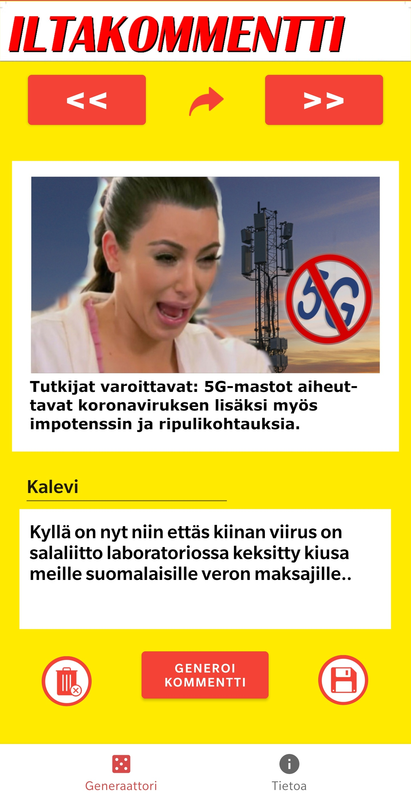

# Iltakommentti - kommenttigeneraattori lööpeille
Oletko koskaan vahingossa selannut liian alas iltalööppien artikkeleiden kommenttiosioon? Jos vastasit "valitettavasti" tai "kyllä, valitettavasti", niin tämä sovellus tarjoaa sinulle loistavan aikaa säästävän ratkaisun osallistaa itsesi kommenttipalstan keskusteluun! Jaa onnettomat ja epäkorrektit mielipiteesi sekunneissa!

Käyttäjä voi valita kommentoinnin kohteeksi ajankohtaisia iltalööppihenkisiä artikkeleita, joihin on tarjolla valmiita kohdennettuja kommentteja generoitavaksi, tai vaihtoehtoisesti käyttäjä voi tallentaa omia kommenttejaan tietokantaan. Sovellus tarjoaa rajapinnan, jolla uutisartikkelin kansikuvineen ja kommentteineen voi jakaa eri sosiaalisen median kanaviin.

Sovellus on devattu osana Metropoliassa suoritettua Android-ohjelmointikurssia syksyllä 2020.

# Sovelluksen päänäyttö

# Huom! Tämä sovellus on toteutettu vain parodiatarkoituksiin, eikä sen tarkoitusperät sovellu millään tavalla käytettäväksi tosielämässä!
